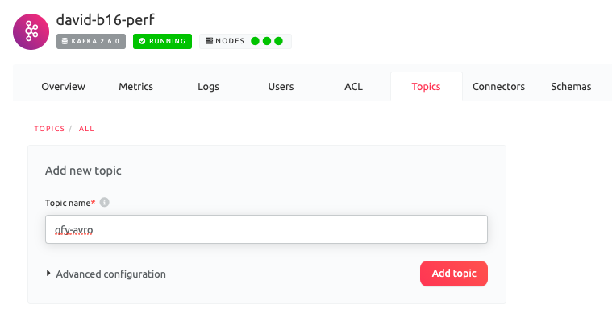
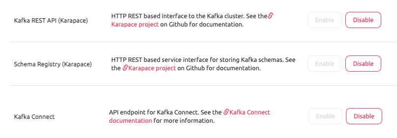
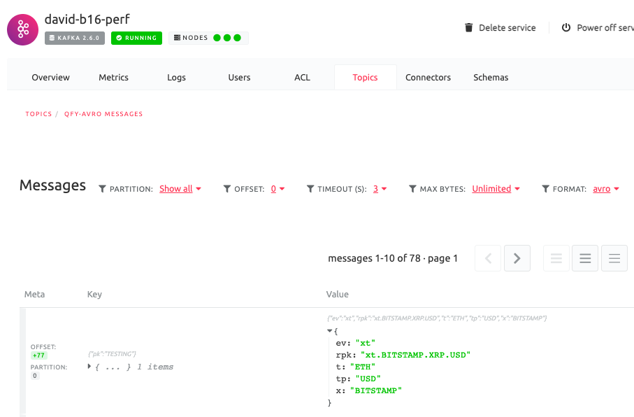
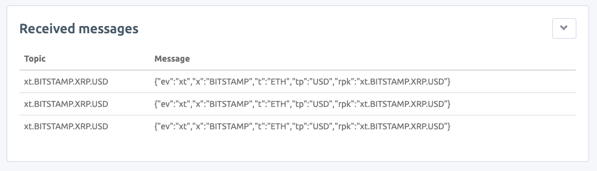

# Aiven Avro Demo

This Java demo application connects to Kafka
and published and Avro Generic record based on
local schema files. It will save the schema to
a schema registry for distributed consuming/processing.

Then we will setup an MQTT sink for publishing topic
data to a dyanmic MQTT topic.

# Setup

## Step 1

Create a Kafka service at [https://console.aiven.io](https://console.aiven.io).
Pick at least the `business-4` plan.

## Step 2

Create the kafka topic `qfy-avro`:



## Step 3

Enable Kafka Connect, REST Proxy, and Schema Registry
on the brokers. Click the enable button next to
"Schema Registy", "Kafka REST API", and "Kafka Connect."



## (Optional) Step 4.0

Provision a cloud MQTT Server. I used the shared
plan from [https://www.cloudmqtt.com/](https://www.cloudmqtt.com/).


## Step 4

Configure the MQTT Task. You can use the following
configuration for a baseline.

```json
{
    "name": "efy-test",
    "connector.class": "com.datamountaineer.streamreactor.connect.mqtt.sink.MqttSinkConnector",
    "tasks.max": "1",
    "key.converter": "io.confluent.connect.avro.AvroConverter",
    "key.converter.schema.registry.url": "https://my-kafka-service.aivencloud.com:12346",
    "key.converter.basic.auth.credentials.source": "USER_INFO",
    "key.converter.basic.auth.user.info": "avnadmin:password",
    "value.converter": "io.confluent.connect.avro.AvroConverter",
    "value.converter.schema.registry.url": "https://my-kafka-service.aivencloud.com:12346",
    "value.converter.basic.auth.credentials.source": "USER_INFO",
    "value.converter.basic.auth.user.info": "avnadmin:password",
    "topics": "qfy-avro",
    "connect.mqtt.hosts": "tcp://driver.cloudmqtt.com:18961",
    "connect.mqtt.username": "mqtt-user",
    "connect.mqtt.password": "mqtt-password",
    "connect.mqtt.service.quality": "1",
    "connect.mqtt.kcql": "INSERT INTO `$rpk` SELECT * FROM qfy-avro WITHTARGET = rpk"
}
```

## Step 5

You can run this service using the included gradle wrapper.


```shell script
./gralew bootRun
```


